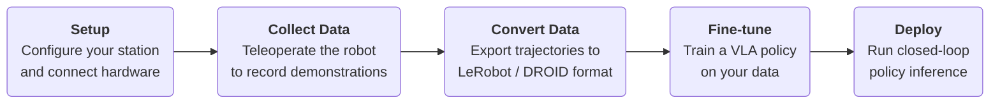

# Workflow

RIO supports the full robot learning workflow — from collecting demonstrations on real hardware to deploying a fine-tuned policy. The diagram below shows how the pieces fit together.


## Steps

### 1. Setup

[Configure Station](station_cfg.md)

All examples are driven by a **station config**: a Python dataclass that declares every hardware and software node in your setup (robot arm, gripper, cameras, recorder, policy server).

Each config lives in `examples/cfg/` as a self-contained file (e.g. `xarm_eef.py`, `xarm_gello.py`, `so100.py`). Edit the one that matches your hardware.

---

### 2. Collect Data

[Teleoperate the Robot](data-collection.md) and [Visualize Data](visualization/rerun.md)

Use a teleoperation script to control the robot and record demonstrations. RIO supports several input devices:

| Device | Config | Teleop script | Guide |
|--------|--------|---------------|-------|
| Spacemouse / Gamepad / Keyboard | `examples/cfg/xarm_eef.py` | `examples.teleop_eef` | [Gamepad](../hardware/teleop/gamepad.md) |
| Gello leader arm | `examples/cfg/xarm_gello.py` | `examples.teleop_leader_follower` | [Gello](../hardware/teleop/gello.md) |
| SO100 leader-follower | `examples/cfg/so100.py` | `examples.teleop_leader_follower` | — |
| SO100 bimanual | `examples/cfg/bimanual_so100.py` | `examples.teleop_leader_follower` | — |

Run `uv run -m examples.cfg` to list all registered stations. Set `STATION=<ClassName>` before running any script.

---

### 3. Convert Data

[Exporting Data](data-export.md)

Convert the recorded `.vla` trajectories to [LeRobot](https://github.com/huggingface/lerobot) / DROID format for use with the openpi training pipeline.

```bash
uv run examples/data/convert_to_lerobot_droid.py --input /data/rollouts/my_task/
```

---

### 4. Fine-tune

[PI0.5 DROID Fine-tuning](pi0_droid_finetuning.md)

Fine-tune a pi0 policy on your collected dataset using the openpi training pipeline.

---

### 5. Deploy 

[Run Policy Inference](deploy.md)

Run the fine-tuned policy on the robot in a closed-loop at a fixed frequency.

```bash
STATION=<YourStation> POLICY=Pi05Cfg uv run -m examples.policy_inference --instruction "Place the cup on the shelf."
```
